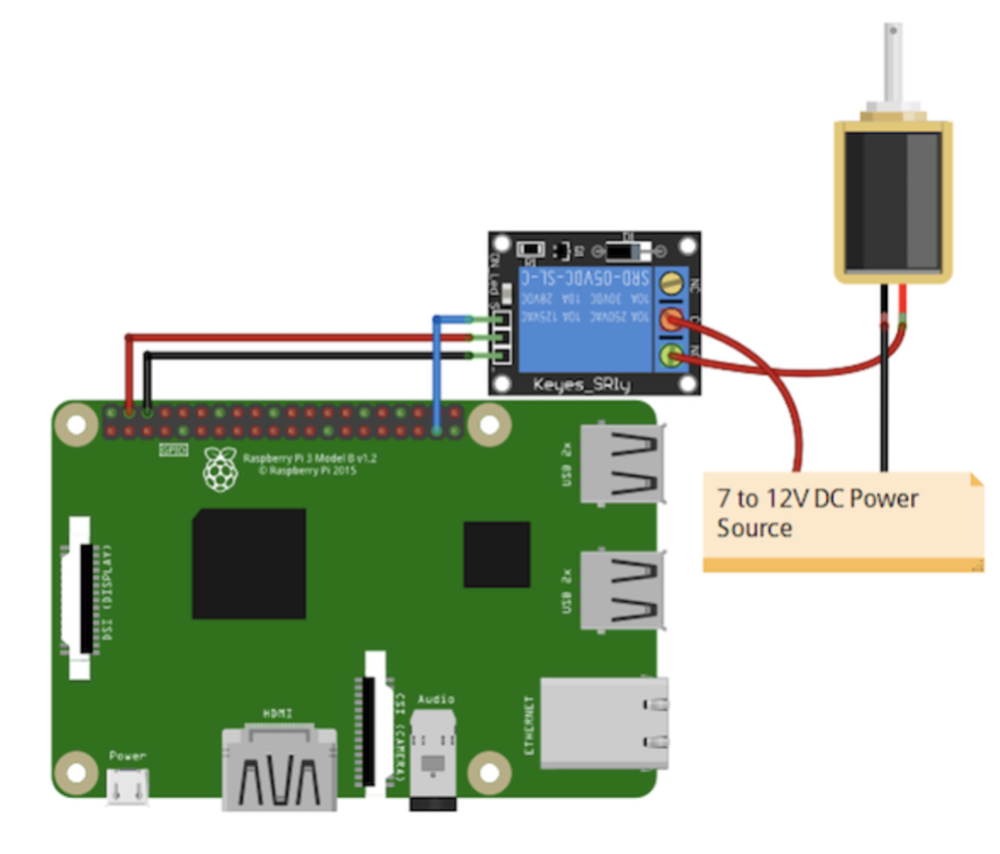

# FaceRecognitionRpi
  Projenin amacı: Raspberry Pi 3 Model B+ kullanılarak yüz tanıma sistemli kapı kilidi tasarlanmıştır. Proje yüz tanıma teknolojisini kullanarak, erişimi kısıtlı, özel oda veya özel kasanın,sadece girişi izin verilen personel, kişinin girmesini amaçlar.
  Kapıyı açmak isteyen kişi önceden sisteme tanıtılmış ise, sistem bu kişiyi tanırsa kapı kilidi açılır.Eğer kapıyı açmak isteyen kişi tanınmıyorsa, kapı kilidi açılmaz ve otomatik olarak ev sahibi kişiye, “Tanınmayan bir kişi kapıyı açmak istiyor “ yazan ve kapıdaki kişinin fotoğraflarını içeren bir e-mail gönderilir. Projenin ilerleyişi: Projeyi tasarlamak için ilk olarak Raspberry Pi kartının kurulumunun yapılması gerekmektedir.Kurulumun nasıl yapıldığı detaylı olarak anlatılacaktır.Daha sonra Raspberry Pi kartını güce bağlamak ve bir kamera modülü bağlamak gerekmektedir. Kapı kilidi ve 5V röle kartı Raspberry Pi ‘nın GPIO pinlerine bağlanır.Sistemin çalışması için gerekli olan yazılım, Python dilinde yazılır ve gerekli kütüphaneler import edilir.E-mail alarm sistemi için de SMTP (Simple Mail Transfer Protocol) kullanılır.
 

 
